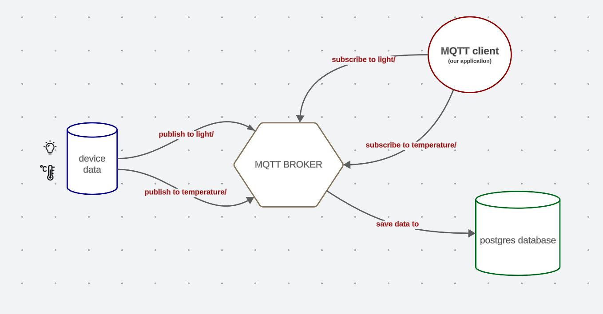

# IOT Data Collector with Mqtt Broker

#### The Project consists of :

- Backend: Spring Boot
- Frontend: React JS
- Database : Postgres
- MQTT : mosquitto


### How to run the project on docker :


#### clone the project: 

```bash
  git clone https://github.com/yasminenebti/MQTTapplication.git
```
#### Access directory

```bash
  cd IOT-Data-Collector-MQTT
```

#### Run Docker

```bash
  docker compose up --build -d
```
#### Access FrontEnd application
```bash
  localhost:3000
```

## Application architecture




